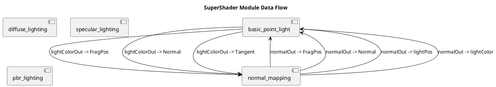

# SuperShader Data Flow and Connection Validation System

## Overview
The SuperShader system implements a comprehensive data flow validation system that ensures correct connections between modules. This document describes the technical architecture and validation mechanisms.

## Data Flow Architecture

### Module Interface Definition
Each module in the SuperShader system defines its interface including:
- **Inputs**: Variables that the module receives from other modules
- **Outputs**: Variables that the module provides to other modules  
- **Uniforms**: Global variables that are available to the module
- **Samplers**: Texture sampling resources

### Connection Validation
The system validates connections between modules using multiple validation layers:

1. **Type Validation**: Ensures the data types are compatible
2. **Semantic Validation**: Validates that the meaning/semantics of connected data match
3. **Interface Compatibility**: Confirms that the connection adheres to module interfaces

## PlantUML Data Flow Diagram

## Interface Specifications

### Basic Point Light Module
- **Inputs**: 
  - `FragPos` (vec3) - Fragment position
  - `Normal` (vec3) - Surface normal vector  
  - `lightPos` (vec3) - Light position
  - `lightColor` (vec3) - Light color
- **Outputs**:
  - `lightColorOut` (vec3) - Calculated light contribution
- **Uniforms**:
  - `lightPos` (vec3) - Light position
  - `lightColor` (vec3) - Light color

### Normal Mapping Module
- **Inputs**:
  - `TexCoords` (vec2) - Texture coordinates
  - `FragPos` (vec3) - Fragment position
  - `Normal` (vec3) - Surface normal
  - `Tangent` (vec3) - Surface tangent
- **Outputs**:
  - `normalOut` (vec3) - Normal in world space
- **Uniforms**:
  - `normalMap` (sampler2D) - Normal map texture

### Diffuse Lighting Module
- **Inputs**:
  - `lightDir` (vec3) - Direction to light
  - `normal` (vec3) - Surface normal
  - `diffuseColor` (vec3) - Diffuse color
- **Outputs**:
  - `diffuseOut` (vec3) - Diffuse lighting contribution

### Specular Lighting Module
- **Inputs**:
  - `lightDir` (vec3) - Direction to light
  - `viewDir` (vec3) - Direction to viewer
  - `normal` (vec3) - Surface normal
  - `specularColor` (vec3) - Specular color
- **Outputs**:
  - `specularOut` (vec3) - Specular lighting contribution

### PBR Lighting Module
- **Inputs**:
  - `position` (vec3) - World position
  - `normal` (vec3) - Surface normal
  - `viewDir` (vec3) - Direction to viewer
  - `albedo` (vec3) - Base color
  - `metallic` (float) - Metallic factor
  - `roughness` (float) - Roughness factor
- **Outputs**:
  - `pbrOut` (vec4) - Final PBR result

## Connection Validation Rules

### Type Compatibility Matrix
| Source Type | Compatible Targets |
|-------------|-------------------|
| vec3 | vec4 (w=1.0), vec3 |
| vec4 | vec3 (w dropped), vec4 |
| float | float, int |
| int | int, float |
| sampler2D | sampler2D |

### Semantic Matching
The system uses semantic matching to validate that connected variables have compatible meanings:
- Position-related: `position`, `pos`, `fragpos`, `worldpos`
- Normal-related: `normal`, `n`
- Color-related: `color`, `col`, `albedo`, `diffuse`
- TexCoord-related: `uv`, `texcoords`

## Technical Validation Process

1. **Interface Extraction**: Each module's interface is extracted either from explicit definitions or by parsing pseudocode
2. **Connection Validation**: Potential connections are validated using type and semantic rules
3. **Graph Building**: Validated connections are used to build a complete data flow graph
4. **Diagram Generation**: PlantUML diagrams are automatically generated from the data flow graph
5. **Documentation Generation**: Technical specifications are generated in JSON and UML formats

## Performance Considerations

- Interface extraction is cached to avoid repeated parsing
- Connection validation uses efficient type matching algorithms
- Large module combinations are processed incrementally

## Error Handling

- Type mismatch errors are clearly reported with source and target information
- Missing interface definitions generate appropriate warnings
- Invalid connections are logged with detailed error messages

## Integration with Existing System

The data flow validation system integrates seamlessly with:
- Module registry for module discovery
- Pseudocode translator for code generation
- Module combination engine for integration
- Performance profiler for optimization analysis

This system ensures that modules are correctly connected and that data flows properly through the shader pipeline, maintaining technical accuracy while providing UML visualization for development and documentation purposes.